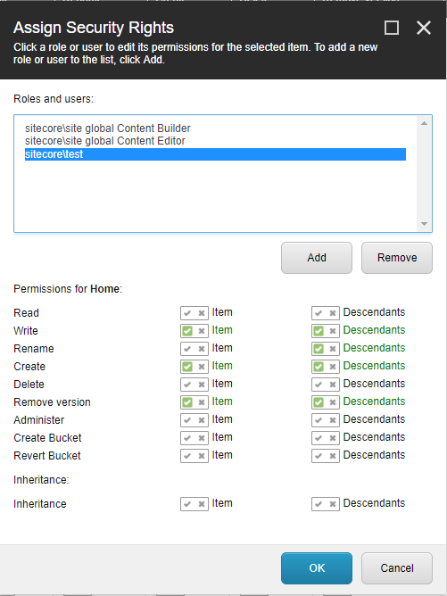
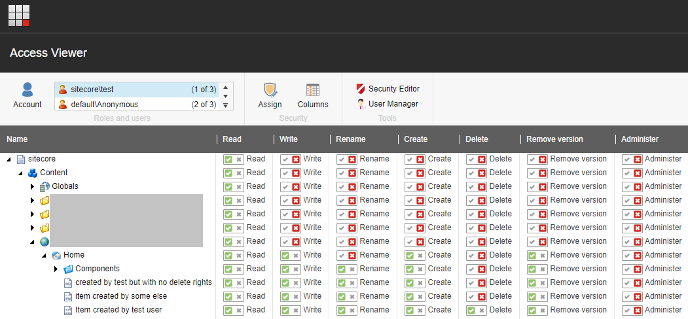

# Sitecore Delete Access Rights
This package enables the "item:removeVersion" access right, 
allowing authors to remove individual item versions without 
allowing authors to delete the entire item. It also allows 
the initial creator of an item to delete his/her own item, 
unless an explicit deny delete access right is applied to 
the item.

[More details in this blog post](https://mikael.com/2017/08/improved-sitecore-delete-item-access-rights/)

## Build and install
Update the nuget package sitecore references if the version
doesn't match your Sitecore version. Compile the solution 
and copy the output dll and the config file to target
instance.

The config file updates the two default authorization providers, 
SqlServerAuthorizationProvider and BucketAuthorizationProvider.
If you've made customization to these providers, this module
needs to be updated accordingly.

## Usage
The module enables the "Remove version" permission in the 
Security Rights dialog. When you need to allow users to delete
item versions, but not the entire item, assign the Remove
version permission accordingly:

The module also enables authors to delete items created by
them selves, unless there are other explicit delete permissions.
Note that the "CreatedBy" field is a versioned field, so the
access right is evaluated based on the very first item version, 
regardless of language.

